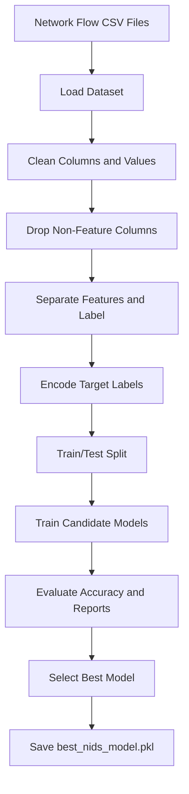
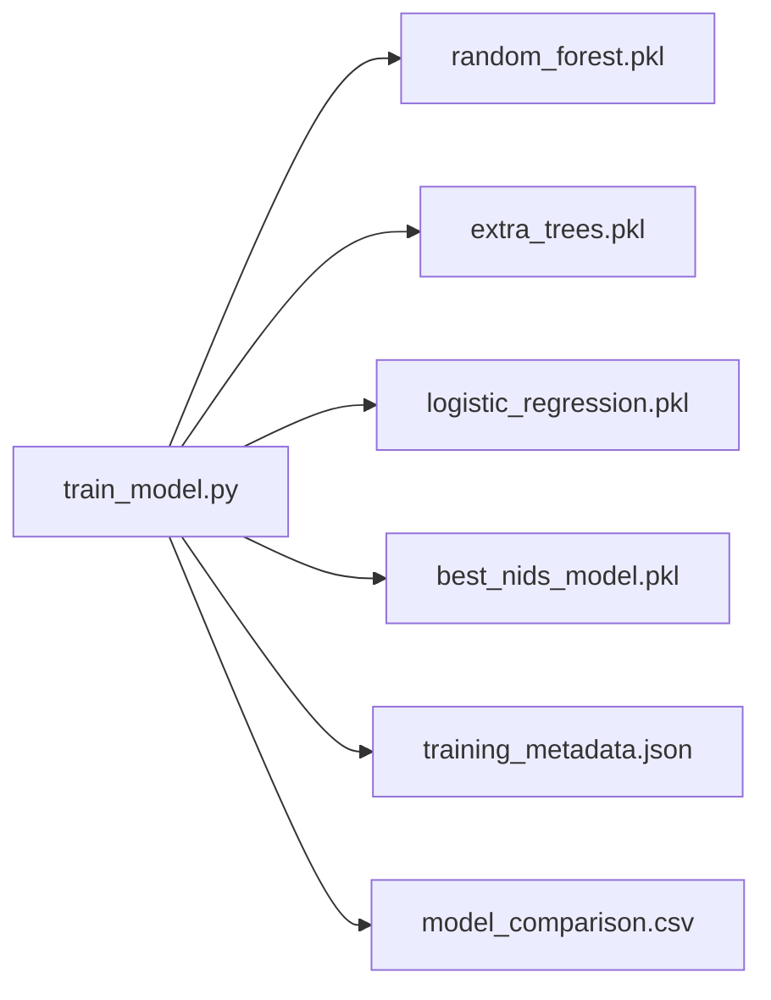
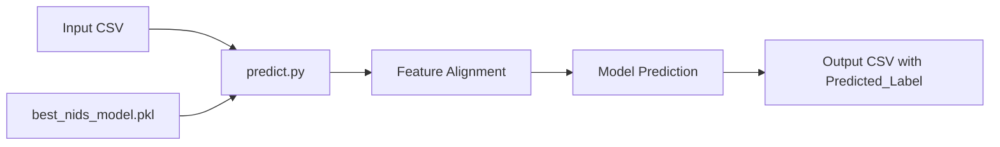

# ML-Only Enterprise Project Overview

## Project Positioning

This project is presented as an enterprise-style machine learning solution for network intrusion detection. It follows a practical structure that a large organization could use for an internal security analytics proof of concept.

It does not claim affiliation with any real MNC or commercial organization.

## ML Scope

The project scope is limited to:

- Dataset preparation
- Feature cleaning
- Model training
- Model evaluation
- Model selection
- `.pkl` artifact generation
- Batch prediction

Backend and frontend implementation are intentionally excluded.

## ML Pipeline

## Artifact Flow

## Prediction Flow

## Enterprise Quality Notes

- The dataset and model artifacts are not committed to GitHub.
- The final model package includes metadata for traceability.
- The code supports deterministic training through `random_state`.
- The training script compares multiple candidate models.
- The prediction script aligns input columns with training columns.
