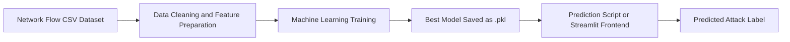
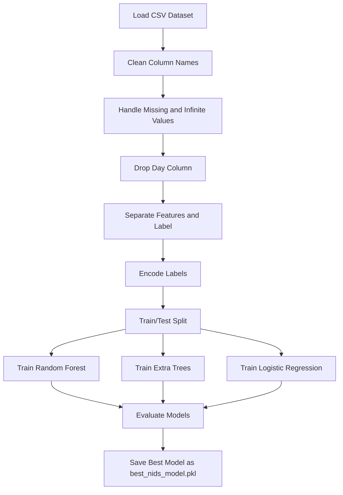
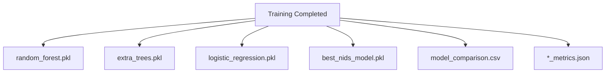
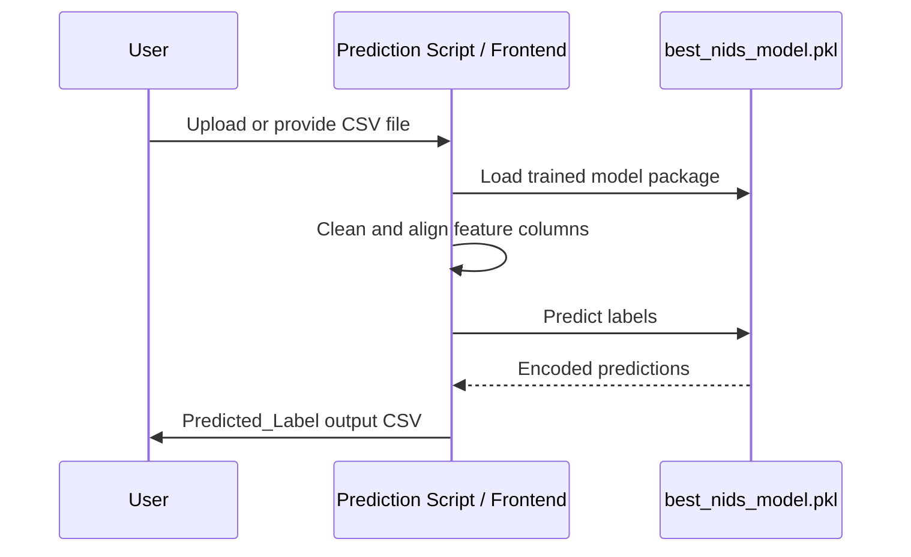

# NIDS Using Machine Learning - Project Explanation

## 1. Project Overview

This project is a Network Intrusion Detection System (NIDS) that uses machine learning to detect malicious network traffic. The system learns patterns from network-flow CSV datasets and predicts whether a new flow is normal traffic or an attack.

The main goal is to classify network activity using features such as ports, protocol, packet counts, flow duration, byte rates, flag counts, active time, and idle time.

## 2. Problem Statement

Modern computer networks receive huge amounts of traffic every second. Manual monitoring is not practical, so an automated NIDS is required. This project trains machine learning models on labeled network-flow data and uses the best model to predict intrusion labels for new traffic records.

## 3. Dataset

The dataset contains CICIDS-style network-flow records. Each row represents one network flow. Important columns include:

- Source Port
- Destination Port
- Protocol
- Flow Duration
- Total Fwd Packets
- Total Backward Packets
- Flow Bytes/s
- Flow Packets/s
- Packet Length Mean
- FIN/SYN/RST/ACK flag counts
- Active and Idle statistics
- Label

The `Label` column is the target output. It tells whether the traffic is `BENIGN` or an attack category.

## 4. System Architecture



## 5. Machine Learning Workflow



## 6. Models Used

Three machine learning models are trained:

| Model | Purpose |
|---|---|
| Random Forest | Strong general-purpose classification model using multiple decision trees. |
| Extra Trees | Similar to Random Forest but adds more randomness, often fast and accurate. |
| Logistic Regression | Baseline model useful for comparison. |

The model with the highest accuracy is saved as `best_nids_model.pkl`.

## 7. Output Files



## 8. Prediction Workflow



## 9. How to Train the Model

Open PowerShell in the project folder:

```powershell
cd E:\NIDS-Using-Machine-Learning
python -m venv .venv
.\.venv\Scripts\Activate.ps1
pip install -r requirements.txt
python model\train_model.py --data dataset --max-rows-per-file 50000
```

After training, the best model is saved here:

```text
model/artifacts/best_nids_model.pkl
```

## 10. How to Predict

```powershell
python model\predict.py --input dataset\Friday11.csv --output predictions.csv
```

The output file contains a new column:

```text
Predicted_Label
```

## 11. Frontend

The Streamlit frontend allows the user to upload a CSV file and download the predicted result:

```powershell
streamlit run frontend\app.py
```

## 12. Advantages

- Automatically detects malicious network traffic.
- Supports multiple ML models.
- Saves the final model as a `.pkl` file.
- Provides command-line prediction.
- Provides a simple frontend for CSV upload.
- Handles large CSV files using row sampling.

## 13. Limitations

- Real-time packet capture is not included yet.
- Accuracy depends on dataset quality and class balance.
- Large datasets may require more RAM and training time.
- The model should be retrained when new attack types are added.

## 14. Future Scope

- Add live packet capture using tools such as CICFlowMeter or Scapy.
- Add database storage for prediction logs.
- Add dashboard charts for attack distribution.
- Add deep learning models.
- Deploy the frontend as a web application.

## 15. Conclusion

This NIDS project uses supervised machine learning to classify network traffic as benign or malicious. It cleans the dataset, trains multiple models, compares their performance, saves the best model as `best_nids_model.pkl`, and provides both CLI and frontend-based prediction.
